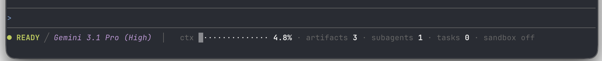
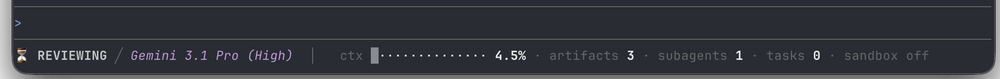
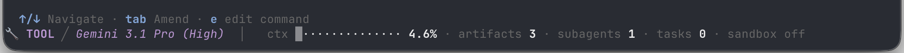

# Custom Status Line

This directory contains a reference implementation (`statusline.sh`) for a custom, dynamic status line for the Antigravity CLI.

## Quick Start

### Option 1: Automatic Setup (Recommended)

Run the included setup script from the root of the repository:

```bash
bash examples/statusline/setup.sh
```

This script will automatically:
1. Copy `statusline.sh` to your platform's global settings directory (so it stays configured even if you move or delete this repository).
2. Configure and enable it in your global `settings.json` file.

### Option 2: Manual configuration

1. Copy `statusline.sh` to a directory of your choice.
2. Edit your `settings.json` file to point `statusLine.command` to the absolute path of `statusline.sh` and set `statusLine.enabled` to `true`:

```json
{
  "statusLine": {
    "command": "/absolute/path/to/statusline.sh",
    "enabled": true
  }
}
```

**Settings file locations:**

| Platform | Path |
| :--- | :--- |
| Linux | `~/.gemini/antigravity-cli/settings.json` |
| macOS | `~/Library/Application Support/antigravity-cli/settings.json` |
| Windows | `%APPDATA%\antigravity-cli\settings.json` |

> [!IMPORTANT]
> The `command` field must be an **absolute path** to the script. Relative paths and `~` expansion are not supported.

After saving, restart `agy` for changes to take effect.

## How it works

The CLI pipes a JSON payload into the script's stdin on each state change. The script:

1. Extracts fields like `agent_state`, `vcs` info, `context_window` usage, and `terminal_width` using `jq`.
2. Computes visual indicators (e.g., a Unicode progress bar for context window usage).
3. Formats the output using standard ANSI 16-color codes.
4. Dynamically adjusts the layout based on the available terminal width (single-line for wide terminals, two-line for narrower ones).

### JSON payload fields

| Field | Type | Description |
| :--- | :--- | :--- |
| `agent_state` | string | Current state: `idle`, `thinking`, `working`, `tool_use` |
| `context_window.used_percentage` | number | Context window utilization (0–100) |
| `vcs.branch` | string | Current Git branch name |
| `vcs.dirty` | boolean | Whether the working tree has uncommitted changes |
| `sandbox.enabled` | boolean | Whether sandbox mode is active |
| `artifact_count` | number | Number of artifacts in the current session |
| `subagents` | array | List of active subagents |
| `task_count` | number | Number of background tasks |
| `model.display_name` | string | Human-readable model name |
| `terminal_width` | number | Current terminal width in columns |

### Prerequisites

- [`jq`](https://jqlang.org/) must be installed and available in `$PATH`.

## Examples

### Default Status Line


### Review Mode


### Tool Execution


## Writing your own

You can use `statusline.sh` as a starting point. The only contract is:

1. Read JSON from stdin.
2. Write one or more lines of ANSI-formatted text to stdout.
3. Exit with code 0.

For the official documentation, see [antigravity.google/docs/cli-statusline](https://antigravity.google/docs/cli-statusline).
