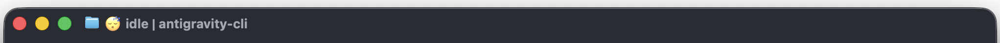
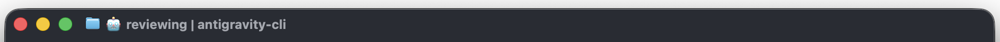
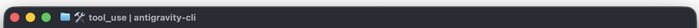

# CLI Title Example

This directory contains an example script (`title.sh`) that demonstrates how to dynamically customize the window title for the Antigravity CLI based on the agent's current state.

For more details on how to use and configure the title script, please refer to the official public documentation:
[https://antigravity.google/docs/cli-title](https://antigravity.google/docs/cli-title)

## How it works

The `title.sh` script reads a JSON payload from standard input, which contains real-time information about the agent's state and context. It then:
1. Extracts the `agent_state` and `workspace.current_dir` using `jq`.
2. Parses the current directory to determine a short workspace name (with special handling for CitC workspaces).
3. Maps the agent state to a corresponding emoji (e.g., 🤔 for thinking, 🛠️ for tool use, 😴 for idle).
4. Outputs the formatted title string in the format: `[Emoji] [State] | [Workspace]`.

## Examples

### Idle State

### Review Mode

### Tool Confirmation

